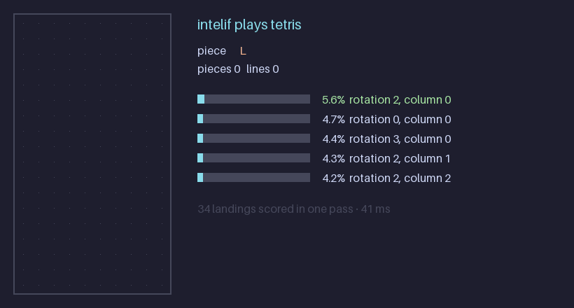

# intelif

Typed probabilistic decisions from a small open model. Give Intelif a `state` and named, typed questions, each with the options you want it to choose between, and it returns a probability for every option.

```text
shared state + named, typed questions  ->  named, typed probabilistic answers
```

The caller supplies the decision space in every request: there are no fixed labels, so the same model routes support tickets, picks tools, chooses an agent's next action or answers yes/no questions. The model judges; your code owns the policy (thresholds, fallbacks, human review).

Intelif is wire-compatible with TypeSafe's Jev (`POST /v1/systemone`), but not affiliated with it.



Intelif v0.1 playing Tetris, a game it was never trained on: for each piece, every legal landing is one option, and all of them are scored in a single forward pass (about 40 ms on an RTX PRO 6000). Reproduce it with `uv run --group examples python examples/tetris.py --gif assets/tetris.gif`; `examples/wikigame.py` plays the Wikipedia game the same way, scoring every link on a page.

## Model

`intelif-qwen3-4b` v0.1 ([Hugging Face](https://huggingface.co/UserMoonlight/intelif-qwen3-4b)) is [Qwen3-4B](https://huggingface.co/Qwen/Qwen3-4B) with LoRA adapters (r=16 on every attention and MLP projection) and a linear scorer. Each option in the prompt is followed by an anchor token; the scorer reads the anchor's final hidden state, and the probabilities are a softmax over the options. One forward pass answers a question, whatever the number of options. The LoRA weights are merged at load time, so inference costs the same as the base model.

## Install

```sh
pip install "intelif @ git+https://github.com/SkAndMl/intelif"
```

Python 3.12 or newer. The model is about 8 GB in bfloat16 and is tested on CUDA GPUs; Apple silicon (MPS) and CPU are supported but untested at this size.

## Quickstart

```python
from intelif import Choice, Intelif, Noul, Score

model = Intelif.from_pretrained()  # UserMoonlight/intelif-qwen3-4b @ v0.1

response = model.system_one(
    state={"ticket": "I was charged twice and need the duplicate refunded today."},
    questions={
        "intent": Choice(
            instructions="What is the customer's main request?",
            criteria={
                "refund": "The customer wants money returned.",
                "technical_help": "The customer needs a bug or integration fixed.",
                "information": None,
            },
        ),
        "urgent": Noul(instructions="Does the ticket communicate time pressure?"),
        "frustration": Score(criteria=["Calm", "Concerned but civil", "Very angry"]),
    },
)

response.choices["intent"].choice         # "refund"
response.choices["intent"].probabilities  # {"refund": 0.93, "technical_help": 0.02, "information": 0.05}
response.nouls["urgent"].noul             # probability that the statement is true
response.scores["frustration"].score      # expected level, 0 to 2
response.model_dump(mode="json")          # the Jev wire format
```

The three primitives:

- `Choice`: pick one option from `criteria` (a mapping of option key to description, or `None` to use the key alone).
- `Noul`: the probability that a statement is true. Optional `criteria` describe what `true` and `false` mean.
- `Score`: a position on an ordered scale given as a list of levels; returns the expected level and a distribution.

Several questions about the same state are answered together. `Noul` and `Score` use the same scoring mechanism as `Choice`; `Score` was not part of training and is experimental.

## Server

```sh
pip install "intelif[server] @ git+https://github.com/SkAndMl/intelif"
intelif serve --port 8000
```

`POST /v1/systemone` takes `{"model": "intelif-latest", "state": ..., "questions": {...}}` and returns the same JSON as `response.model_dump(mode="json")`. `GET /v1/models` lists the model and `GET /health` reports the device. Set `INTELIF_API_KEY` to require a bearer token. Requests that do not fit the context window return 413 and invalid questions return 422.

For a one-off question from the shell:

```sh
intelif ask --state "Where is my new card?" --choice "card arrival,refund,lost card"
```

## Results

Held-out test splits, never used for training or model selection. BANKING77's 20 held-out intents and all of CLINC150 are labels the model never saw in training. Each cell is accuracy / expected calibration error; the zero-shot baselines score the same options with Qwen3-4B's log-probabilities, once from a raw prompt and once through the chat template without thinking.

| split | chance | Qwen3-4B, raw prompt | Qwen3-4B, chat | Intelif v0.1 |
|---|---|---|---|---|
| BANKING77, seen intents | 1.3% | 45.2% / 0.226 | 63.3% / 0.336 | **89.7% / 0.011** |
| BANKING77, 20 held-out intents | 1.3% | 46.6% / 0.224 | 59.9% / 0.367 | **78.5% / 0.065** |
| CLINC150 (never trained on) | 0.7% | 54.4% / 0.104 | 72.6% / 0.246 | **86.5% / 0.021** |
| MASSIVE | 1.7% | 59.1% / 0.190 | 64.9% / 0.316 | **89.9% / 0.019** |
| xLAM tool selection (unseen tools) | 32.4% | 98.2% / 0.012 | 98.9% / 0.010 | **99.9% / 0.002** |
| ALFWorld next action | 4.0% | 55.1% / 0.236 | 59.0% / 0.390 | **85.5% / 0.029** |
| WebShop next action | 13.7% | 26.4% / 0.404 | 20.7% / 0.709 | **56.0% / 0.061** |
| MNLI mismatched | 38.6% | 69.6% / 0.191 | 80.8% / 0.181 | **92.0% / 0.020** |
| SNLI | 38.3% | 68.6% / 0.219 | 82.1% / 0.173 | **92.7% / 0.019** |
| QQP | 50.0% | 79.3% / 0.068 | 80.5% / 0.187 | **87.8% / 0.015** |
| PAWS | 50.0% | 75.9% / 0.105 | 77.4% / 0.220 | **93.6% / 0.021** |
| BoolQ | 50.0% | 85.6% / 0.063 | 84.6% / 0.149 | **88.9% / 0.023** |
| CommonsenseQA | 20.0% | 51.5% / 0.151 | 74.3% / 0.244 | **82.7% / 0.028** |
| OpenBookQA | 25.0% | 39.2% / 0.383 | 74.0% / 0.243 | **90.2% / 0.029** |
| SciQ | 25.0% | 92.3% / 0.023 | 98.2% / 0.018 | **98.7% / 0.006** |

ALFWorld and WebShop measure agreement with one recorded expert action, not task success. The full numbers, including negative log-likelihood and chat with thinking, are in [`baseline_results.json`](https://huggingface.co/UserMoonlight/intelif-qwen3-4b/blob/main/baseline_results.json) and come from `training/baseline.py`.

### Decision Index 0.2.1

| index | Knowledge & Reasoning | Language Understanding | Retrieval & Classification | Tools & Automation | Arts & Human Taste | median latency |
|---|---|---|---|---|---|---|
| **31.77** | 18.3 | 31.1 | 39.6 | 51.0 | 17.8 | 16.5 ms |

Chance-corrected scores (0 is random guessing, 100 is perfect) from the packaged engine on all 150,317 requests, with every request answered. The raw index is 48.62. Run on one NVIDIA RTX PRO 6000 Blackwell; the results, per-benchmark scores and environment are in [`UserMoonlight/intelif-decision-index`](https://huggingface.co/datasets/UserMoonlight/intelif-decision-index). The model is strongest where the suite looks like its training data (BFCL 89.6, BANKING77 83.6, CLINC150 81.5) and near chance on knowledge-heavy, multi-step and taste benchmarks (GPQA, HLE, CRUXEval, ForecastBench). BANKING77's train split is part of the training data.

## Evaluation and training

The repository also holds the code behind these numbers; none of it is part of the installed package.

- `evals/decision_index/`: how to run the [Decision Index](https://github.com/apolinario/decision-index) with the packaged engine `intelif.integrations.decision_index:IntelifEngine`.
- `training/train.py`: the v0.1 training recipe. It reads the model spec from `config.json` and writes `adapter.safetensors`, `config.json`, `train.log` and `results.json` to `runs/train/`.
- `training/baseline.py`: chance, zero-shot Qwen3-4B (raw prompt, chat, chat without thinking) and Intelif on the same held-out splits.

```sh
uv sync --all-extras --all-groups
uv run python training/train.py --smoke --no-upload   # about 50 steps, to check the setup
uv run python training/train.py                       # full run, about 1,500 steps on one GPU
uv run python training/baseline.py
uv run pytest tests
```

Training data: BANKING77 (train split, 20 of its 77 intents held out), MASSIVE, xLAM function calling, ALFWorld and WebShop expert trajectories, MNLI, SNLI, QQP, PAWS, BoolQ, CommonsenseQA, OpenBookQA and SciQ, each pinned to a dataset revision in `training/data.py`. None of it comes from the Decision Index suite.

## Limitations

- English only.
- Trained on choice-style decisions; knowledge-heavy and multi-step reasoning tasks are its weakest area.
- `Score` was not trained and is experimental.
- Calibration was measured on the splits above; expect it to be weaker on unfamiliar kinds of decisions.
- Prompts are limited to Qwen3-4B's 40,960-token context; longer requests are refused, never truncated.

## Licence

The code is MIT. See the [model card](https://huggingface.co/UserMoonlight/intelif-qwen3-4b) for the weights and the licences of the training data.
